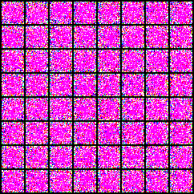
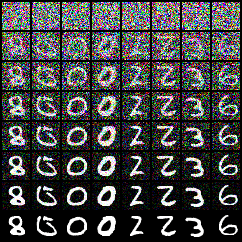
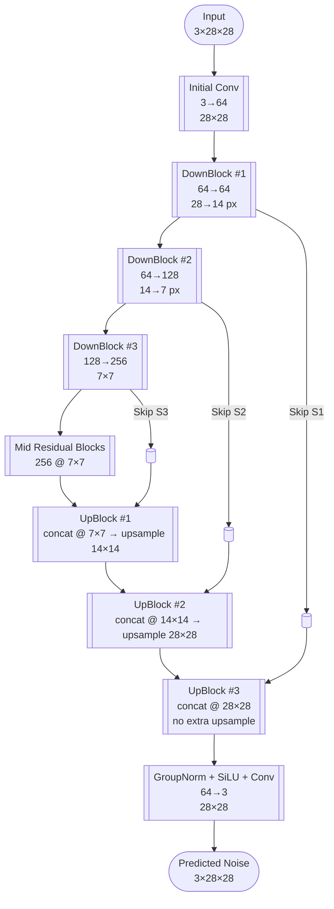

<p align="center">
  <a href="#">
    
  </a>
</p>

<h1 align="center">✨ DDPM MNIST</h1>

<p align="center">
  <a href="https://pytorch.org/"></a>
  <a href="./requirements.txt"></a>
  <a href="./dockerfile"></a>
  <a href="https://github.com/Hsun1128/NMIST-Diffusion-Model"></a>
</p>

本專案從頭訓練 Denoising Diffusion Probabilistic Model (DDPM) 於 MNIST PNG 影像，涵蓋資料管線、精簡版 U-Net、擴散過程實作、訓練/生成腳本與視覺化工具，快速重現與延伸相關應用。

## 📈 成果摘要

- FID ≈ **7.85**（`trained_model/mnist-ddpm-baseline/checkpoints/best.pt`，生成 10,000 張影像與 `mnist/` 參考集比較）
- 範例生成樣本：`trained_model/mnist-ddpm-baseline/sample_step_*.png`
- 擴散過程視覺化：`trained_model/mnist-ddpm-baseline/diffusion_progress.png`

<p align="center">
  <a href="docs/images/diffusion_progress.png">
    
  </a>
</p>

> 圖示展示 8 個採樣階段的還原過程：自純噪聲逐步生成清晰的手寫數字。

> [!TIP]
> 想快速驗證訓練效果？直接執行 `bash run_training.sh` 後檢視 `trained_model/<run>/diffusion_progress.png` 與 `train_log.csv`，即可確認收斂與生成品質。

> [!WARNING]
> 由於專案會持續從 `mnist/` 讀取 PNG，請確保該資料夾只包含 MNIST 提供的合法影像，並避免在公開環境暴露個人資料或非授權影像。

## 🚀 專案說明

- **模組化設計**：`src/` 以資料、擴散、模型、訓練、生成、可視化拆分，方便替換或擴充。
- **重現性**：統一使用 `mnist/` 資料夾與 `set_seed`，即使在 Docker/Compose 環境也能穩定重現。
- **視覺化完整**：提供 demo GIF、訓練過程採樣、擴散軌跡與 FID 計算流程。
- **高效率生成**：`run_generate.sh` 支援大批量產圖（預設 10k）並允許自訂批次大小避免 OOM。

## 專案結構（Tree View）

```
.
├── README.md
├── requirements.txt
├── dockerfile                 # CUDA 12.1 + PyTorch 2.3.1/cu121 環境
├── docker-compose.yaml        # 方便啟動容器
├── run_training.sh            # 基線訓練腳本（50 epochs, base_channels=128）
├── run_generate.sh            # 生成 10,000 張 28×28 RGB PNG
├── docs/
│   └── images/                # README 示意圖（demo.gif, diffusion_progress.png）
├── src/
│   ├── data.py                # MNIST PNG 資料集與可重現切分
│   ├── diffusion.py           # DDPM q/p 過程與採樣 API
│   ├── model.py               # 精簡 U-Net（時間嵌入 + 殘差 + 上下採樣）
│   ├── trainer.py             # 核心訓練迴圈（logging、sampling、checkpoint）
│   ├── logger.py              # CSV logger
│   ├── train_diffusion.py     # 訓練入口點
│   ├── generate_images.py     # 依 checkpoint 生成大量 PNG
│   └── visualize_diffusion.py # 產生擴散軌跡 snapshot 圖
├── mnist/                     # MNIST的 PNG 資料（預設 --data-dir mnist）
├── trained_model/             # 範例訓練輸出（checkpoints、樣本、loss 曲線）
└── generated/                 # 預設生成影像輸出目錄
```

## 模型與方法概述

1. **Forward Diffusion**[（Ho et al., 2020）](https://arxiv.org/abs/2006.11239)：依線性 β 排程注入噪聲，形成 `x_t = √ᾱ_t x_0 + √(1-ᾱ_t)ϵ`。
2. **精簡 U-Net**（參考 DDPM 原論文與社群常用 U-Net 實作）：
   - Sinusoidal timestep embedding → MLP → FiLM 式調整。
   - DownBlock ×3 擷取多尺度特徵，保留 skip connections。
   - Bottleneck 雙殘差強化表徵能力。
   - UpBlock ×3 重建影像並輸出噪聲估計。
3. **Reverse Sampling**[（Ho et al., 2020](https://arxiv.org/abs/2006.11239)；[Nichol & Dhariwal, 2021）](https://arxiv.org/abs/2102.09672)：`DiffusionProcess` 以 DDPM 公式逐步去噪，提供 `sample()`/`p_sample()` 與 snapshot 工具。

此架構保留 DDPM 核心流程，並針對 28×28 MNIST 調整通道與採樣策略以降低資源需求。

### 模型架構示意



每個 Down/Up Block 皆包含兩層 `ResidualBlock`，並由時間嵌入提供 FiLM 式調制；UpBlock 會在拼接 skip 之前使用 bilinear interpolation 以對齊空間尺寸。

## 📦 安裝指引

### 本機安裝（Python 3.10, 使用 Conda）

```bash
conda create -n mnist-ddpm python=3.10 -y
conda activate mnist-ddpm
pip install --upgrade pip
pip install -r requirements.txt
```


資料集準備：

```bash
# MNIST data 由 NTU TAICA CVPDL 課程提供，僅使用 MNIST Training set: 60,000 handwritten digits
wget -O mnist.zip "https://drive.usercontent.google.com/download?id=1xVCJD6M6sE-tZJYxenLzvuEkSiYXig_F&export=download&authuser=0&confirm=t"
unzip mnist.zip -d mnist
ls mnist | head
```

`src/data.py` 會直接讀取 `mnist/` 目錄，並把灰階圖轉為 RGB、正規化到 [-1, 1]。

### 🐳 Docker 環境

專案隨附 `dockerfile` 與 `docker-compose.yaml`。若偏好一次建置並重複使用容器，建議透過 Compose：

```bash
# 第一次建置
docker compose build mnist

# 進入互動式環境（GPU、自動掛載目前資料夾到 /app）
docker compose run --rm mnist bash
```

上述設定會：

- 使用 `network_mode: host` 與 `/dev/shm` 共享記憶體，避免 dataloader 因預設共享記憶體不足而失敗。
- 啟用 `NVIDIA_VISIBLE_DEVICES=all` 及 `PYTORCH_CUDA_ALLOC_CONF=expandable_segments:True`，以充分利用多 GPU 並改善 CUDA 記憶體分段配置。

若僅需一次性執行，也可使用傳統 `docker build`／`docker run`，兩者環境一致。

## ⚡️ 訓練流程

### 本機訓練

```bash
bash run_training.sh
```

或自定義參數：

```bash
python src/train_diffusion.py \
  --data-dir mnist \
  --batch-size 64 \
  --epochs 50 \
  --lr 2e-4 \
  --base-channels 128 \
  --image-size 28 \
  --timesteps 1000 \
  --beta-start 1e-4 \
  --beta-end 0.02 \
  --sample-every 2000 \
  --checkpoint-every 1000 \
  --log-every 50 \
  --eval-every 1 \
  --eval-batches 50 \
  --checkpoint-epoch-every 5 \
  --output-dir trained_model \
  --run-name mnist-ddpm-baseline \
  --seed 3407
```

### Docker 訓練

在 Compose 中執行同樣腳本即可：

```bash
docker compose run --rm mnist bash run_training.sh
```

### 訓練輸出

```
trained_model/mnist-ddpm-baseline/
├── checkpoints/         # ckpt_*.pt + best.pt
├── sample_step_*.png    # 定期生成圖
├── train_log.csv        # step/epoch/loss/lr 記錄
├── train_log.png        # train vs eval loss 曲線
└── diffusion_progress.png
```

### 參數說明

- `--train-split`：預設 0.9，透過固定種子確保劃分一致。
- `--sample-every`：控制訓練中可視化頻率，值越小越常生成樣本。
- `--checkpoint-epoch-every`：除步數 checkpoint 外，額外保留 epoch 粒度檔案以利回溯。

## 影像生成

### 本機生成

```bash
bash run_generate.sh [checkpoint_path] [output_dir]
```

預設值：`checkpoint = trained_model/mnist-ddpm-baseline/checkpoints/best.pt`、`output_dir = generated/`、輸出 10,000 張 `00001.png` 至 `10000.png`。

客製化範例：

```bash
python src/generate_images.py \
  --checkpoint trained_model/mnist-ddpm-baseline/checkpoints/best.pt \
  --output-dir generated \
  --num-images 10000 \
  --batch-size 64 \
  --model-image-size 28 \
  --output-size 28
```

### Docker 生成

```bash
docker compose run --rm mnist \
  bash run_generate.sh trained_model/mnist-ddpm-baseline/checkpoints/best.pt generated
```

## 擴散過程可視化

```bash
python src/visualize_diffusion.py \
  --run-name mnist-ddpm-baseline \
  --output-root trained_model \
  --segments 7 \
  --batch-size 8
```

或指定自訂 checkpoint：

```bash
python src/visualize_diffusion.py \
  --checkpoint trained_model/mnist-ddpm-baseline/checkpoints/best.pt \
  --output-path trained_model/mnist-ddpm-baseline/diffusion_progress.png
```

## 生成品質評估（FID）

以 `pytorch-fid` 比較生成樣本與真實 MNIST PNG：

```bash
python -m pytorch_fid \
  generated/path/to/images \
  mnist/path/to/reference
```

若沿用預設資料夾，命令可簡化為：

```bash
python -m pytorch_fid generated mnist
```

請確保兩資料夾皆含相同解析度（28×28）與通道（RGB）的大量 PNG。若使用 `trained_model/mnist-ddpm-baseline/checkpoints/best.pt` 生成 10,000 張影像與 `mnist/` 參考資料比較，可得到 **FID ≈ 7.85**。

## 進階設定與建議

- **模型容量**：調整 `--base-channels` 以平衡品質與記憶體需求，`time_dim` 會自動對應。
- **採樣效率**：`run_generate.sh` 預設 `--batch-size 4080`，若 GPU 記憶體不足可降低此值。
- **重現性**：`trainer.set_seed` 同步設定 Python/random/Torch/CUDA 的隨機種子。
- **評估延伸**：可搭配 `pytorch-fid`、`torchmetrics` 等工具納入更多指標（IS、precision/recall）。

## 參考資料

- Ho, Jonathan, Ajay Jain, and Pieter Abbeel. “Denoising Diffusion Probabilistic Models.” *Advances in Neural Information Processing Systems* 33 (2020). [arXiv:2006.11239](https://arxiv.org/abs/2006.11239)
- Nichol, Alex, and Prafulla Dhariwal. “Improved Denoising Diffusion Probabilistic Models.” *ICML* (2021). [arXiv:2102.09672](https://arxiv.org/abs/2102.09672)
- PyTorch 官方文件 — [https://pytorch.org/docs/](https://pytorch.org/docs/)
- torchvision 官方文件 — [https://pytorch.org/vision/stable/index.html](https://pytorch.org/vision/stable/index.html)
- pytorch-fid GitHub 專案 — [https://github.com/mseitzer/pytorch-fid](https://github.com/mseitzer/pytorch-fid)
- 原始 DDPM MNIST 參考實作（GitHub 範例） — [https://github.com/lucidrains/denoising-diffusion-pytorch](https://github.com/lucidrains/denoising-diffusion-pytorch)

---

如需擴充本專案（自定義資料集、不同影像尺寸或條件式生成），請先調整 `MNISTImageFolder` 的前處理與 `UNet` 的通道/採樣深度，並同步修改訓練與生成腳本中的 `--image-size`、`--base-channels` 等參數，以維持擴散過程穩定性。
